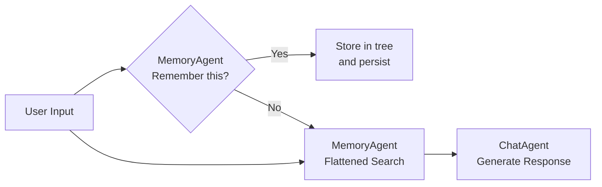

# MemGrove

> 🌳 **Tree-Structured AI Memory That Grows With You · Permanent · Local · Open Source**

A locally-deployed dual-agent dialogue system with **AI-powered tree-structured memory** and **intelligent conversation agent**. All memories are permanently retained, supporting self-growing categories, semantic retrieval, and cross-session continuity.


## ✨ Core Features

| Feature | Description |
|--------|------------|
| **Tree-Structured Memory** | Initial schema from `schema.json`, infinite nesting supported |
| **AI Autonomous Decision** | LLM controls: remember or not, how to classify, how to retrieve |
| **Proactive Retrieval** | Prepares relevant memories before answering |
| **Flattened Efficient Search** | Compresses tree to key-value for faster semantic search |
| **Permanent Persistence** | All memories saved to `memory_tree.json`, survives restarts |
| **No Auto-Cleanup** | Memories are kept forever — true long-term memory |
| **OpenAI Compatible** | Works with Qwen, GLM, Ollama, and any OpenAI-compatible models |

## 🚀 Quick Start

### 1. Clone the repo
```bash
git clone https://github.com/your-username/memgrove.git
cd memgrove
```

### 2. Install dependencies
```bash
pip install -r requirements.txt
```

### 3. Configure your model (example for Qwen3)
Edit `main.py`:

```python
# main.py
MODEL_NAME = "qwen3"  # or qwen-max, llama3, gemma, etc.
BASE_URL = "https://dashscope.aliyuncs.com/compatible-mode/v1"  # DashScope
API_KEY = os.getenv("DASHSCOPE_API_KEY")  # Set via environment variable
```

Supported deployments:
- **DashScope**: `BASE_URL = "https://dashscope.aliyuncs.com/compatible-mode/v1"`
- **Ollama**: `BASE_URL = "http://localhost:11434/v1"`, `API_KEY = "ollama"`
- **vLLM / LMStudio**: Use your local API endpoint

### 4. Launch
```bash
# Set API key (Linux/macOS)
export DASHSCOPE_API_KEY="sk-your-key"

# Run
python main.py
```

### 5. Try it out
```
You: I'm Alex, living in Shanghai
Assistant: Got it.

You: Where do I live?
Assistant: You live in Shanghai.

You: tree
→ Shows full memory tree (JSON format)
```

## 🏗️ Project Structure

```
memgrove/
├── main.py              # Entry point + interactive loop
├── memory_tree.py       # Tree structure + persistence (core)
├── memory_agent.py      # AI decisions: filter/classify/retrieve
├── chat_agent.py        # Dialogue logic + proactive retrieval
├── schema.json          # Initial category template
├── memory_tree.json     # Auto-generated: persistent memory storage
└── requirements.txt     # Dependencies
```

## 🔧 Configuration

### Initial Schema (`schema.json`)
```json
{
  "root": {
    "Personal Info": {
      "Basic": {},
      "Contact": {},
      "Address History": {}
    },
    "Projects": { ... },
    "Interests": { ... },
    "Knowledge Base": { ... }
  }
}
```
> Modify this file to customize initial structure (**only affects first launch**).

### Persistent Storage (`memory_tree.json`)
- Auto-generated, contains all user memories
- Human-readable JSON, supports backup/migration
- Saved immediately after every memory update

## 🤖 How It Works

### MemoryAgent
1. **Filters**: Decides if input is worth remembering (LLM-driven)
2. **Stores**: Chooses best category path or creates new subcategory
3. **Retrieves**: Flattens tree for semantic search of relevant content

### ChatAgent
1. Receives user input
2. Asks MemoryAgent: "Should we remember this?"
3. **Proactively retrieves** relevant memories before answering
4. Generates natural response based on memory context



## 🌍 Compatibility

Works with any **OpenAI-compatible API**:
- **Qwen** (DashScope)
- **Llama 3 / Mistral** (Ollama, vLLM)
- **Gemma / Phi-3** (LMStudio)
- **OpenAI Official Models**

> Just update `MODEL_NAME`, `BASE_URL`, and `API_KEY` in `main.py`.

## 📜 License

MIT License — see [LICENSE](LICENSE)

## 🙌 Contribute

PRs welcome! Suggested improvements:
- Memory deduplication & merging
- Category depth limits
- Full conversation history persistence
- Web UI

---

**Give your AI true long-term memory — locally, privately, forever.**  
Made with ❤️ for developers who believe in persistent AI memory.